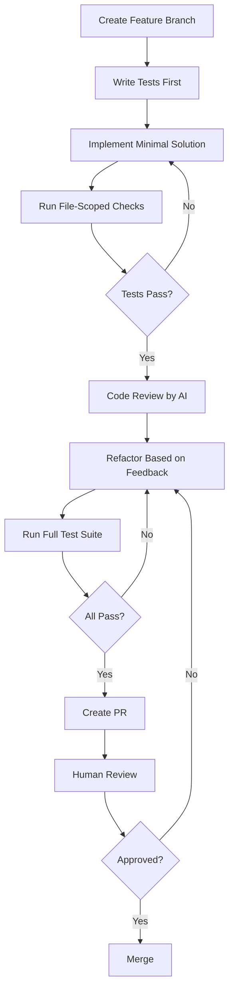

# Best Practices for Agentic Coding

A comprehensive guide to effective AI-assisted development using structured rules, context management, and proven workflows.

## Table of Contents

1. [Core Philosophy](#core-philosophy)
2. [Getting Started](#getting-started)
3. [Rule Design Principles](#rule-design-principles)
4. [Context Management](#context-management)
5. [Prompting Techniques](#prompting-techniques)
6. [Workflow Patterns](#workflow-patterns)
7. [Quality Assurance](#quality-assurance)
8. [Team Collaboration](#team-collaboration)
9. [Common Pitfalls](#common-pitfalls)
10. [Advanced Patterns](#advanced-patterns)

## Core Philosophy

### The Golden Rule: Context is King

AI agents are only as good as the context and rules you provide. Garbage in, garbage out.

**Key Principles:**

1. **Explicit Over Implicit**: "Use TypeScript strict mode" beats "follow best practices"
2. **Concrete Over Abstract**: "Copy `src/components/Button.tsx` pattern" beats "use good patterns"
3. **Show, Don't Tell**: Reference actual files rather than describing patterns
4. **Iterate Based on Behavior**: Add rules when you see repeated mistakes
5. **Security First**: Never trust AI-generated code without review

### The Trust Spectrum

```
Low Trust                                          High Trust
├─────────────┼─────────────┼─────────────┼─────────────┤
Security      Algorithms    Business       Boilerplate
Critical                    Logic          Code

<─── More Review Required        Less Review Required ───>
```

**Apply appropriate scrutiny based on code criticality:**
- **Security-critical**: Manual review + SAST + penetration testing
- **Algorithm-heavy**: Unit tests + performance benchmarks + peer review
- **Business logic**: Integration tests + stakeholder review
- **Boilerplate**: Automated tests + quick review

## Getting Started

### Step 1: Start Small

Don't try to document everything upfront. Start with:

```markdown
# [Project Name]

## Tech Stack
- Language: [primary language]
- Framework: [main framework]
- Database: [database]

## Key Rules
- [Most important rule]
- [Second most important rule]
- [Third most important rule]

## When Stuck
Ask before making architectural changes.
```

**Target**: 300-500 tokens initially

### Step 2: Observe and Iterate

For 1-2 weeks, observe AI behavior:
- What mistakes does it make repeatedly?
- What questions does it ask?
- What patterns does it miss?

Add rules to address observed issues.

### Step 3: Grow Organically

Expand sections as needed:
- Add security rules after seeing security issues
- Document testing patterns after test quality problems
- Add performance guidelines when optimization becomes critical

**Target**: Grow to 1,500-2,500 tokens over time

### Step 4: Maintain and Refine

**Monthly review checklist:**
- [ ] Are rules still relevant?
- [ ] Are there new patterns to document?
- [ ] Can any rules be simplified?
- [ ] Are there redundant rules?
- [ ] Does the file size need optimization?

## Rule Design Principles

### 1. Be Specific and Actionable

❌ **Bad** (vague):
```markdown
- Follow TypeScript best practices
- Write clean code
- Use good naming
```

✅ **Good** (specific):
```markdown
- Use TypeScript strict mode with `exactOptionalPropertyTypes` enabled
- Functions must have explicit return type annotations
- Variables: camelCase with auxiliary verbs (isLoading, hasError)
- Components: PascalCase noun-based names (UserProfile, not UserComponent)
```

### 2. Use Examples from Your Codebase

❌ **Bad** (abstract):
```markdown
- Use proper error handling patterns
```

✅ **Good** (concrete with reference):
```markdown
- For API errors, copy the pattern from `src/lib/api/error-handler.ts`
- For form validation errors, see `src/components/forms/ContactForm.tsx`
```

### 3. Create Rule Hierarchies

Organize rules by scope and importance:

```markdown
## Critical Rules (Never Violate)
- All user inputs must be validated with Zod schemas
- Never commit secrets to repository
- All database queries use parameterized queries

## Important Rules (Follow Unless Justified)
- Prefer functional programming over OOP
- Components should be under 200 lines
- Test coverage minimum 80% for critical paths

## Preferences (Default Behavior)
- Use arrow functions for React components
- Prefer named exports over default exports
- Use absolute imports with @/ prefix
```

### 4. Tag Rules for Traceability

Use abbreviations that AI can reference:

```markdown
## Core Principles

* **Simplicity First (SF):** Choose simplest solution
* **Readability Priority (RP):** Code must be immediately understandable
* **Dependency Minimalism (DM):** No new libs without justification
* **Security First (SecF):** Validate all inputs, no secrets in code
```

When AI applies these, it references: `[SF] Chose simple forEach over complex reduce` or `[SecF] Added input validation with Zod`

### 5. Use Positive and Negative Examples

```markdown
### Authentication Patterns

✅ **DO: Use JWT with proper validation**
```typescript
const decoded = jwt.verify(token, JWT_SECRET, {
  algorithms: ['HS256'],
  issuer: 'your-app',
  audience: 'your-api'
})
```

❌ **DON'T: Skip token validation**
```typescript
const decoded = jwt.decode(token) // INSECURE - no verification
```

### 6. Document the "Why"

Rules with rationale are followed better:

```markdown
- **Never use `any` type** 
  Why: Defeats TypeScript's purpose, makes refactoring dangerous
  Instead: Use `unknown` with type guards or proper types

- **No `console.log` in production**
  Why: Performance impact, potential information leakage
  Instead: Use proper logging library with levels
```

## Context Management

### Token Budget Strategy

**Typical context windows (2025):**
- Small models: ~128K tokens
- Large models: ~200K tokens  
- Advanced models: ~1M+ tokens

**Cost considerations:**
- Input tokens: ~$0.01 per 1K tokens
- Output tokens: ~$0.04 per 1K tokens (4x more expensive)

**Optimization strategy:**
```
Context Budget Allocation:
├── AGENTS.md: 1,500-2,500 tokens (10-15%)
├── Current file: 500-1,000 tokens (5-10%)
├── Related files: 2,000-3,000 tokens (15-20%)
├── Dependencies: 1,000-2,000 tokens (10%)
└── Output buffer: 10,000+ tokens (60%+)
```

### File-Scoped Commands (Critical Optimization)

**Impact comparison:**

| Operation | File-Scoped | Project-Wide | Time Saved | Tokens Saved |
|-----------|-------------|--------------|------------|--------------|
| Type check | 3 seconds | 2 minutes | 97% | ~15,000 |
| Lint | 1 second | 30 seconds | 97% | ~8,000 |
| Test | 2 seconds | 4 minutes | 98% | ~20,000 |
| Format | <1 second | 10 seconds | 90% | ~2,000 |

**Always document file-scoped commands:**

```markdown
### File-Scoped Commands (Preferred - Fast)
```bash
# Type check single file (3 seconds)
npm run tsc --noEmit path/to/file.ts

# Lint single file (1 second)
npm run eslint path/to/file.ts

# Run single test (2 seconds)
npm run vitest run path/to/file.test.ts
```

**Mark expensive operations clearly:**
```markdown
### Project-Wide Commands (Use Sparingly - Ask First)
```bash
# Full build (5 minutes) - ASK BEFORE RUNNING
npm run build

# Full test suite (4 minutes) - ASK BEFORE RUNNING
npm run test
```

### Hierarchical Configuration (Monorepos)

**Problem**: Loading entire monorepo context is wasteful

**Solution**: Nested AGENTS.md files

```
monorepo/
├── AGENTS.md                    # Universal team standards
├── packages/
│   ├── frontend/
│   │   └── AGENTS.md           # Frontend-specific rules
│   ├── backend/
│   │   └── AGENTS.md           # Backend-specific rules
│   └── mobile/
│       └── AGENTS.md           # Mobile-specific rules
```

**Inheritance model:**
1. Load most specific AGENTS.md (e.g., `packages/frontend/AGENTS.md`)
2. Override/extend with general rules from root `AGENTS.md`
3. Specific rules take precedence over general rules

**Example root AGENTS.md:**
```markdown
# Team-Wide Standards

## Git Workflow (Applies to All Packages)
- Conventional commits required
- Feature branches from main
- PR required for all changes

## Security (Applies to All Packages)
- No secrets in code
- All inputs validated
- HTTPS only in production
```

**Example package-specific AGENTS.md:**
```markdown
# Frontend Package Rules

## Extends: /AGENTS.md

## Tech Stack (Frontend Specific)
- React 18.3 + Next.js 14
- TailwindCSS 3.4
- Zustand for state management

## Frontend-Specific Rules
- Server Components by default
- Client Components only when needed
- No inline styles - use Tailwind utilities
```

### Reference External Documentation

Instead of embedding everything:

```markdown
## API Documentation
See OpenAPI spec at `/docs/api/openapi.yaml`

## Design System
Refer to Figma: [link] or Storybook at `/storybook`

## Architecture Decisions
See ADRs in `/docs/adr/` directory

## Component Patterns
Browse component library at `/docs/components.md`
```

**Benefits:**
- Smaller AGENTS.md file
- Single source of truth for documentation
- Updates in one place propagate everywhere

## Prompting Techniques

### The Feature Implementation Pattern

**Structure your requests:**

```
1. Context: "I'm implementing [feature] in [location]"
2. Requirements: "It should [specific behaviors]"
3. Constraints: "Follow patterns from [reference file]"
4. Validation: "Include tests for [scenarios]"
5. Success Criteria: "Done when [measurable outcomes]"
```

**Example:**

```
I'm implementing user avatar upload in src/components/Profile/AvatarUpload.tsx

Requirements:
- Support PNG, JPEG, WebP (max 5MB)
- Preview before upload
- Crop to square aspect ratio
- Upload to S3 with signed URLs

Constraints:
- Follow form pattern from src/components/forms/ImageUploadForm.tsx
- Use upload utilities from src/lib/upload/s3-client.ts
- Match existing profile component styling

Validation:
- Test file type validation
- Test file size limits
- Test upload error handling
- Test preview rendering

Done when:
- Component renders with preview
- Files upload successfully to S3
- Error states handled gracefully
- Tests passing with 90%+ coverage
```

### The Debugging Pattern

**Structure debugging requests:**

```
1. Observation: "What I'm seeing: [actual behavior]"
2. Expectation: "What should happen: [expected behavior]"
3. Context: "Relevant code: [file paths or snippets]"
4. Investigation: "What I've tried: [debugging steps]"
5. Question: "Where should I look next?"
```

**Example:**

```
Observation: Timer shows NaN after 5 minutes running

Expectation: Should show remaining time in MM:SS format

Context:
- Timer component: src/components/Timer/TimerWidget.tsx
- Timer logic: src/lib/timer/timer-manager.ts
- Using interval: setInterval(() => tick(), 1000)

Investigation:
- Console shows remainingSeconds becomes NaN
- Happens only after 5+ minutes
- Not reproducible in development, only production

Where should I look next?
```

### The Review Pattern

Ask AI to review its own code:

```
Before we proceed, please review the code you just generated:

1. Security: Are all inputs validated? Any injection risks?
2. Performance: Any O(n²) operations? Unnecessary re-renders?
3. Error Handling: What happens if [edge case]?
4. Testing: What test cases should cover this?
5. Compliance: Does it follow our AGENTS.md rules?

List any concerns and suggest improvements.
```

### The Iteration Pattern

For complex features, iterate in small steps:

```
Let's implement this in 3 phases:

Phase 1 (10 min): Basic functionality
- Core logic only
- No UI polish
- Happy path only
- STOP and let me test

Phase 2 (10 min): Error handling
- Add validation
- Handle edge cases
- Error states in UI
- STOP and let me test

Phase 3 (10 min): Polish
- Loading states
- Accessibility
- Animations
- Final testing

Start with Phase 1 only. Don't proceed to Phase 2 until I confirm Phase 1 works.
```

## Workflow Patterns

### Feature Development Workflow



**Best practices:**
- One feature per branch
- Atomic commits with conventional format
- Tests before implementation (TDD when possible)
- File-scoped checks during development
- Full checks before PR only
- Human review always required

### Bug Fix Workflow

```
1. Reproduce: Write failing test demonstrating bug
2. Isolate: Identify exact code causing issue
3. Fix: Minimal change to pass test
4. Verify: Ensure test now passes
5. Regression: Add tests for related edge cases
6. Document: Update docs if behavior clarification needed
```

### Refactoring Workflow

```
1. Tests First: Ensure comprehensive test coverage
2. Small Steps: Refactor in tiny, verifiable increments
3. Green Always: Never have failing tests for >5 minutes
4. One Thing: Change one thing at a time
5. Review Impact: Check performance, bundle size, behavior
6. Documentation: Update docs and examples
```

## Quality Assurance

### Code Review Checklist

**Before submitting PR, verify:**

**Functionality:**
- [ ] Feature works as specified
- [ ] Edge cases handled
- [ ] Error states graceful
- [ ] Performance acceptable

**Code Quality:**
- [ ] Follows AGENTS.md rules
- [ ] No code duplication
- [ ] Proper error handling
- [ ] Comments explain "why", not "what"

**Testing:**
- [ ] Unit tests for logic
- [ ] Integration tests for workflows
- [ ] Tests cover edge cases
- [ ] Coverage meets threshold

**Security:**
- [ ] Inputs validated
- [ ] No secrets in code
- [ ] No SQL injection risks
- [ ] Authentication/authorization correct

**Performance:**
- [ ] No unnecessary computations
- [ ] Database queries optimized
- [ ] Bundle size impact checked
- [ ] No memory leaks

### AI-Generated Code Review

**Ask AI to review using this prompt:**

```
Review the code you just generated against these criteria:

SECURITY:
- Input validation present?
- SQL injection risks?
- XSS vulnerabilities?
- Authentication checked?

PERFORMANCE:
- Algorithm complexity reasonable?
- Database queries optimized?
- Unnecessary re-renders?
- Memory leaks possible?

CORRECTNESS:
- Edge cases handled?
- Error handling complete?
- Type safety maintained?
- Business logic accurate?

MAINTAINABILITY:
- Clear variable names?
- Proper abstraction level?
- DRY principle followed?
- Testable design?

COMPLIANCE:
- Follows AGENTS.md rules?
- Matches existing patterns?
- Documentation updated?
- Tests included?

List any concerns and rate severity (Critical/High/Medium/Low).
```

### Testing Strategy

**Test pyramid:**

```
    /\
   /  \    10% E2E Tests (slow, brittle, high value)
  /____\
 /      \  30% Integration Tests (medium speed, medium value)
/__________\
            60% Unit Tests (fast, reliable, focused)
```

**Testing guidelines:**

1. **Unit Tests**: Pure functions, utilities, business logic
   - Fast (<10ms per test)
   - Isolated (no external dependencies)
   - Focused (one behavior per test)

2. **Integration Tests**: API endpoints, database operations
   - Medium speed (~100ms per test)
   - Use test database
   - Test happy path + common errors

3. **E2E Tests**: Critical user workflows only
   - Slow (~5-30 seconds per test)
   - Authentication flow
   - Payment flow
   - Core user journeys

**AI testing prompt template:**

```
Generate tests for [function/component]:

Unit Tests (implement ALL):
- Happy path with valid inputs
- Edge case: empty input
- Edge case: maximum values
- Edge case: invalid type
- Error: [specific error condition]

Integration Tests (if applicable):
- Successful workflow
- Error handling
- Concurrent operations

Ensure:
- Tests are deterministic (no randomness)
- Tests are isolated (no shared state)
- Tests are fast (mock slow operations)
- Descriptive test names (describe behavior, not implementation)
```

## Team Collaboration

### Shared vs. Personal Configuration

**Shared (committed to repository):**
- AGENTS.md (project-specific rules)
- .cursorrules, .windsurfrules (symlinks to AGENTS.md)
- .github/copilot-instructions.md (repository rules)
- Security, testing, performance rules

**Personal (IDE settings, not committed):**
- Keyboard shortcuts
- Editor preferences
- Local AI model preferences
- Development environment setup

### Onboarding New Team Members

**Day 1 checklist:**
- [ ] Clone repository
- [ ] Review AGENTS.md
- [ ] Setup AI coding assistant
- [ ] Verify tool reads AGENTS.md (ask about coding standards)
- [ ] Implement small feature as practice
- [ ] Get code reviewed by team

**Share this prompt for onboarding:**

```
I'm new to this codebase. Help me understand:

1. What's the project about? (high-level overview)
2. What's the tech stack? (languages, frameworks, tools)
3. What are the key coding standards? (from AGENTS.md)
4. Where do different types of files go? (project structure)
5. How do I run tests and checks? (development workflow)
6. What's a good first issue to work on? (suggest starter tasks)

After explaining, quiz me with 3 questions to ensure I understood.
```

### Handling Rule Conflicts

When team members disagree on rules:

1. **Discuss in PR**: Debate happens in code review comments
2. **Document Decision**: Add to AGENTS.md with rationale
3. **Link to ADR**: Create Architecture Decision Record if significant
4. **Review Quarterly**: Revisit contentious rules every 3-6 months

**Example resolution process:**

```markdown
## Controversial Rule: Default vs Named Exports

**Context**: Team split on export style preference

**Decision**: Use named exports (except Next.js pages/layouts)

**Rationale**:
- Better IDE autocomplete and refactoring
- Easier to grep for usage
- Prevents naming inconsistencies
- Exception for Next.js: framework requires default exports

**Review Date**: Q3 2025

**Related ADR**: docs/adr/0023-named-exports.md
```

## Common Pitfalls

### Pitfall 1: Over-Reliance on AI

**Problem**: Accepting all AI suggestions without critical thinking

**Solution**:
- Always review AI-generated code
- Understand what the code does before accepting
- Ask "why" for architectural decisions
- Run tests and validate behavior
- Use AI as a collaborator, not an oracle

### Pitfall 2: Vague Rules

**Problem**: "Use best practices" - AI doesn't know what you mean

**Solution**: Be specific with examples
```markdown
❌ "Use best practices for React"
✅ "Use functional components with hooks. For forms, copy pattern from src/components/forms/ContactForm.tsx"
```

### Pitfall 3: Ignoring Context Limits

**Problem**: Including entire codebase in every request

**Solution**:
- Use file-scoped commands
- Reference specific files with @-mentions
- Create new sessions when context grows large
- Implement hierarchical configs for monorepos

### Pitfall 4: No Security Review

**Problem**: Trusting AI-generated security-critical code

**Solution**:
- Always review authentication/authorization code
- Run SAST tools on AI-generated code
- Implement secrets scanning
- Have security expert review critical paths

### Pitfall 5: Inconsistent Updates

**Problem**: AGENTS.md becomes outdated

**Solution**:
- Schedule monthly reviews
- Update when tech stack changes
- Add rules when seeing repeated mistakes
- Assign ownership to specific team member

### Pitfall 6: Tool Lock-in

**Problem**: Rules only work with one AI tool

**Solution**:
- Use AGENTS.md as universal base
- Keep tool-specific features separate
- Test with multiple tools
- Avoid proprietary formats when possible

## Advanced Patterns

### Multi-Agent Workflows

Assign specialized agents to different tasks:

**Architecture Agent:**
```markdown
Role: High-level design and system architecture
Focus: Component structure, data flow, technology choices
Tools: Diagramming, documentation, ADRs
Depth: Shallow implementation, deep architectural thinking
```

**Implementation Agent:**
```markdown
Role: Writing production code
Focus: Following patterns, implementing features
Tools: Code generation, refactoring, testing
Depth: Deep implementation, follows architecture from above
```

**Review Agent:**
```markdown
Role: Code quality and security review
Focus: Finding bugs, security issues, performance problems
Tools: Static analysis, test coverage, best practices
Depth: Critical analysis, constructive feedback
```

**Example workflow:**
1. Architecture Agent: Design user authentication system
2. Implementation Agent: Implement based on architecture
3. Review Agent: Review for security and quality
4. Implementation Agent: Address feedback
5. Human: Final review and merge

### Prompt Chaining

Break complex tasks into sequential prompts:

```
Prompt 1: "Design database schema for user profiles with following requirements..."
[Review output]

Prompt 2: "Based on the schema above, generate Prisma schema with proper relations..."
[Review output]

Prompt 3: "Generate migration SQL for the Prisma schema..."
[Review output]

Prompt 4: "Create API endpoints for CRUD operations on user profiles..."
[Review output]

Prompt 5: "Generate integration tests for the API endpoints..."
[Final review and merge]
```

### Context Injection Patterns

**Pattern 1: Dynamic Examples**
```markdown
When implementing [feature], check git history for similar features:
`git log --all --grep="[feature keyword]" --oneline -10`
Copy patterns from the most recent implementation.
```

**Pattern 2: Living Documentation**
```markdown
Before implementing, read:
1. @docs/architecture.md - System design
2. @docs/api-spec.md - API contracts  
3. @CHANGELOG.md - Recent changes
4. git log -20 -- path/to/relevant/dir - Recent modifications
```

**Pattern 3: Test-Driven Context**
```markdown
Before writing code:
1. Read existing tests for similar features
2. Understand test patterns and assertions
3. Write new tests following the same patterns
4. Implement code to pass tests
```

### Continuous Improvement Loop

```
Observe → Analyze → Update → Validate → Repeat
```

**Monthly review process:**

1. **Observe (Week 1)**
   - Collect AI-generated code samples
   - Note repeated mistakes
   - Track time spent on reviews
   - Gather team feedback

2. **Analyze (Week 2)**
   - Identify patterns in mistakes
   - Find missing rules
   - Spot unclear guidelines
   - Review rule effectiveness

3. **Update (Week 3)**
   - Add new rules for common issues
   - Clarify confusing rules
   - Remove outdated rules
   - Add examples from codebase

4. **Validate (Week 4)**
   - Test updated rules with AI
   - Collect team feedback
   - Measure improvement
   - Document changes

---

**Remember**: Agentic coding is a skill that improves with practice. Start simple, iterate based on results, and continuously refine your approach.
